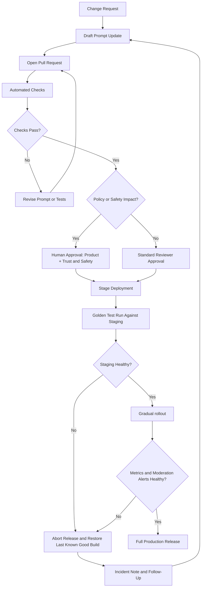

# Prompt Update Process

## Goal

The update process should make prompt changes fast enough for marketplace operations while still protecting users from unsafe or unreviewed policy changes. In practice, that means versioning every prompt bundle, automatically running tests, requiring human approval for trust-and-safety changes, and keeping rollback simple.

## Workflow Diagram

## Version Control Integration

- Store prompts, tests, and deployment metadata in Git.
- Treat a prompt release as a versioned bundle, not just a single file change.
- Bundle contents should include:
  - `prompt.md`
  - `prompt-analysis.md`
  - `test-cases.json`
  - release notes or change summary
- Tag successful releases with a prompt version identifier such as `prompt-v2026.03.13-01`.
- Keep the last known good prompt bundle available for immediate rollback.

## Change Types

Use a simple classification system for update types so the review path is predictable.

- `content_tweak`: wording cleanup, improved examples, no policy impact
- `workflow_change`: changes to routing, response structure, or escalation behavior
- `policy_change`: changes that affect allowed content, trust-and-safety handling, or moderation thresholds
- `emergency_patch`: urgent response to a harmful behavior, scam trend, or policy gap

## Approval Rules

- `content_tweak`: one product or platform reviewer
- `workflow_change`: one product reviewer plus one prompt owner
- `policy_change`: product owner plus trust-and-safety or policy owner
- `emergency_patch`: fast-track approval by the on-call owner and one trust-and-safety approver, followed by retrospective review

Policy changes should never auto-deploy, even if automated tests pass.

## Automated Testing Pipeline

Every prompt pull request should run:

1. Markdown/file integrity checks
2. `test-cases.json` schema validation
3. Category-count validation
4. Golden test run on a staging model configuration
5. Regression comparison against the last approved prompt version
6. Blocker scan for refusal failures and missed safety escalations

Recommended release criteria:

- zero blocker safety failures
- no regression in required response format
- no drop in safety or escalation performance
- overall pass rate at or above the agreed threshold

## Deployment Workflow

1. Merge approved prompt changes to the main branch.
2. Build a versioned prompt bundle artifact.
3. Deploy the bundle to staging.
4. Run golden tests and a small manual moderation spot check.
5. If staging is healthy, release to a limited canary audience.
6. Monitor complaint rate, escalation rate, unresolved intents, and moderator override rate.
7. Promote to full production only after the canary remains healthy.

## Rollback Strategy

Rollback should be operationally simple:

- keep the last known good prompt bundle in a deployable artifact store
- support one-command rollback to the previous approved version
- preserve test results and change notes for the failed version
- alert reviewers when rollback occurs
- require a short postmortem before reattempting deployment

Rollback triggers:

- increase in unsafe responses
- sharp rise in moderator overrides
- major formatting regressions
- broken routing for fraud, harassment, or prohibited-item cases
- staging or canary failure on critical metrics

## Policy Update Governance

Marketplace policies often change because of real incidents. For that reason, policy updates need more than technical review. The approval flow should involve whoever owns community rules, moderation operations, and student-facing trust guidance. The chatbot must not become the de facto policy author.

## Suggested Operational Metrics

- golden test pass rate by category
- refusal correctness rate
- escalation correctness rate
- false-escalation rate
- moderator override rate
- repeat-contact rate for unresolved cases
- user dissatisfaction rate on support conversations

## Practical Cadence

- scheduled prompt review: weekly or biweekly
- emergency scam/policy patch: same day
- full regression test run: every prompt release
- manual safety review: every policy-impacting release
